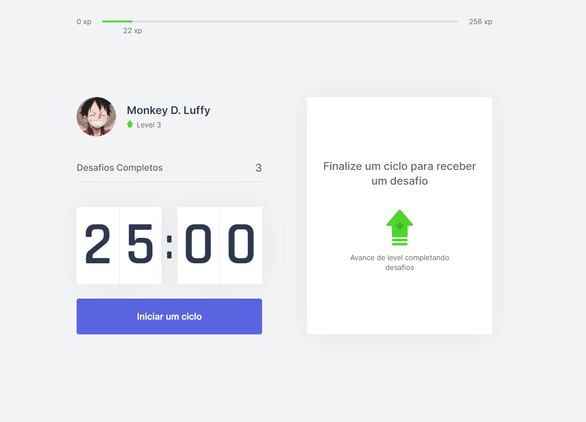

# nlw4-moveit
### Sistema desenvolvido através do evento NLW disponibilizado pela Rocketseat.
O wakeup é um sistema que disponibiliza desafios em um tempo determinado para evitar essa exaustão no nosso corpo.
Para tornar o sistema interessante, foi adicionado um gamificação para que o usuário ganhe uma gratificação (xp) em cada desafio concluído.
O sistema está em evolução e disponível no domínio: https://moveit-sepia-six.vercel.app

### Conceitos utilizados
* Typescript;
* React;
* JSX;
* React Components;
* React Hooks;
* React Context;
* NextJS;
* NodeJS;
* Cookies;
* Yarn

### Executar aplicação
#### Instalar dependências
yarn install

#### Executar aplicação
yarn dev

#### Realizar deploy
##### Instalar vercel
npm i -g vercel
##### Autenticação e criação do projeto no vercel
vercel
##### fazendo deploy com vercel em produção
vercel --prod

### Prévia da interface do sistema

